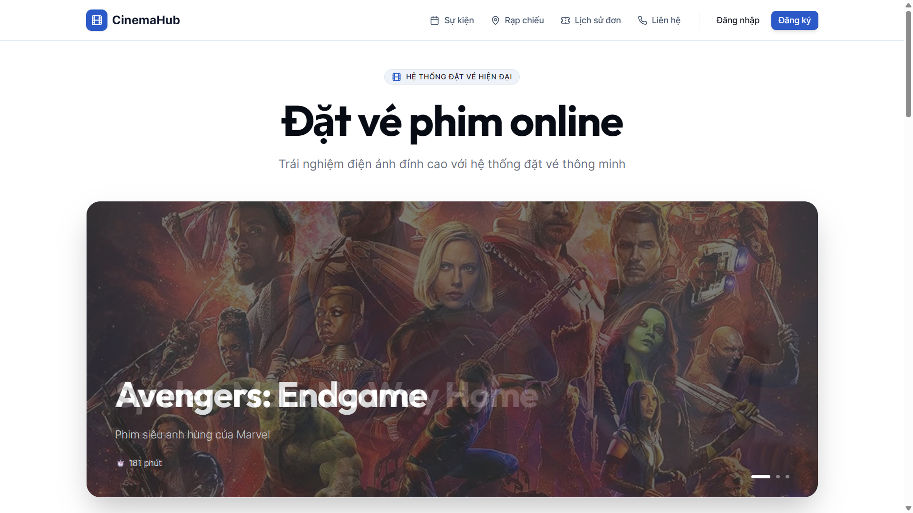
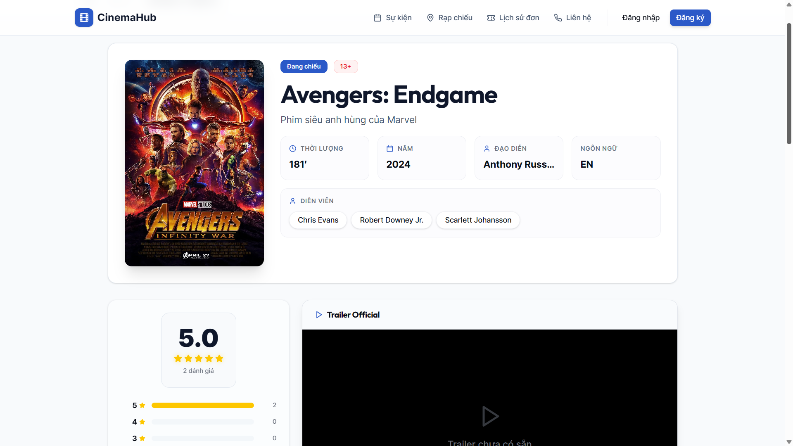
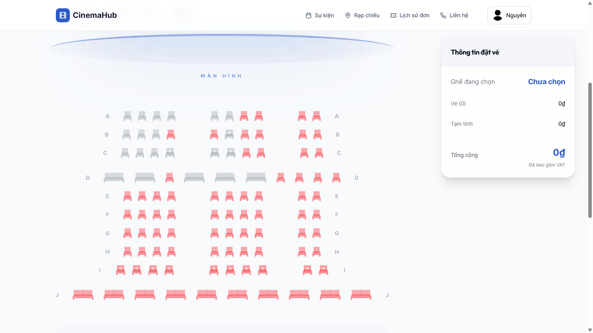
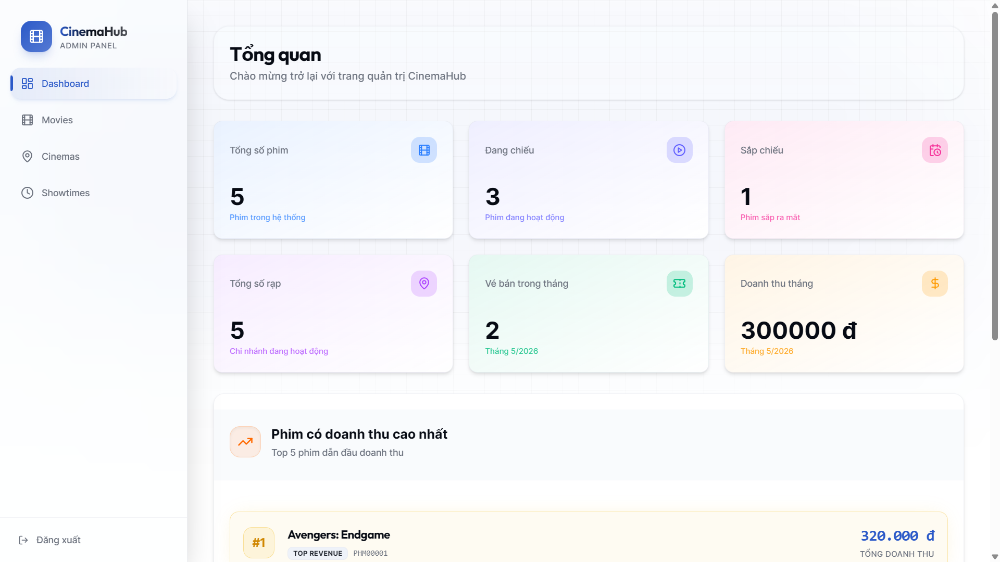

# 🎬 Movie Ticket Booking System

## 📑 Project Overview
This is a comprehensive online movie ticket booking system developed for a **Database Systems** course. The platform simulates real-world services like CGV or Lotte Cinema. The core focus is on a highly normalized **MySQL** database (3NF) and the implementation of business logic through **Triggers**, **Stored Procedures**, and **Transactions** directly within the database layer to ensure data integrity and high performance.

## ✨ Key Features
### 👤 User Experience
- **Secure Authentication**: JWT-based login and registration system.
- **Membership Program**: Tiered loyalty system (Copper, Gold, Diamond, VIP) with automated rank progression based on accumulated points.
- **Movie Discovery**: Browse films by status (Now Showing, Upcoming) with rich metadata and reviews.

### 🎫 Booking Workflow
- **Multi-step Reservation**: Intuitive flow from movie selection to payment.
- **Interactive Seat Mapping**: Select from various seat types including **Standard**, **VIP**, and **Couple**.
- **Food & Beverage**: Order snacks and drinks as part of the ticket booking process.
- **Dynamic Vouchers**: Apply promotional codes linked to membership tiers and special events.

### 🛠 Administrative Control
- **Comprehensive Dashboard**: Real-time overview of system statistics.
- **Resource Management**: Full CRUD operations for Movies, Cinema Halls, and Showtimes.
- **Security**: Role-based access control (RBAC) ensuring only authorized staff can access the admin panel.

## 📐 Technical Architecture
- **Frontend**: Next.js 15 (App Router), React 19, Tailwind CSS v4, Lucide React, Shadcn/UI.
- **Backend**: Node.js, Express.js.
- **Database**: MySQL with `mysql2` client.
- **Database Logic**: 
  - **Triggers**: Automated ID generation for all entities (e.g., `RAP00001`, `NV00001`).
  - **Procedures**: Atomic transactions for complex bookings and point calculations.
  - **Constraints**: Strict referential integrity to prevent orphan records.

## 🚀 Getting Started

### 1. Database Setup
1. Install and start a **MySQL** server.
2. Create a database named `TicketBookingSystem`.
3. Execute the SQL scripts in the `sql/` directory:
   - Run `sql/TicketBookingSystem.sql` first to create tables and seed initial data.
   - Run `sql/procedures_triggers_functions.sql` to load the stored logic.

### 2. Backend Installation
1. Navigate to the `server` directory:
   ```bash
   cd server
   npm install
   ```
2. Create a `.env` file in the `server` folder:
   ```env
   host=localhost
   user=your_mysql_username
   password=your_mysql_password
   database=TicketBookingSystem
   JWT_SECRET=your_jwt_secret_token
   FRONTEND_URL=http://localhost:3000
   ```
3. Start the server:
   ```bash
   npm start
   ```

### 3. Frontend Installation
1. From the project root:
   ```bash
   npm install
   ```
2. Create a `.env.local` file in the root directory:
   ```env
   NEXT_PUBLIC_API_URL=http://localhost:5000
   ```
3. Launch the development server:
   ```bash
   npm run dev
   ```
4. Open [http://localhost:3000](http://localhost:3000) in your browser.

## 🔑 Test Accounts
| Role | Identity | Password |
| --- | --- | --- |
| **Admin** | `admin` | `123456789` |
| **Customer** | `user1@gmail.com` | `password123` |

## 📸 Project Showcase
| | |
| --- | --- |
|  |  |
|  |  |

## 📂 Project Structure
```text
ticket-booking-system/
├── app/                  # Frontend: Next.js Pages & Routes
├── components/           # Frontend: UI Components & Layouts
├── server/               # Backend: Node.js Express Application
│   ├── src/              # Logic: Routes, Controllers, Services, Models
│   └── .env              # Backend Environment Variables
├── sql/                  # Database: Schema, Procedures, and Mock Data
├── public/               # Static Assets
└── README.md             # Project Documentation
```

---
*Created as a Database Systems course project at Ho Chi Minh City University of Technology (HCMUT).*